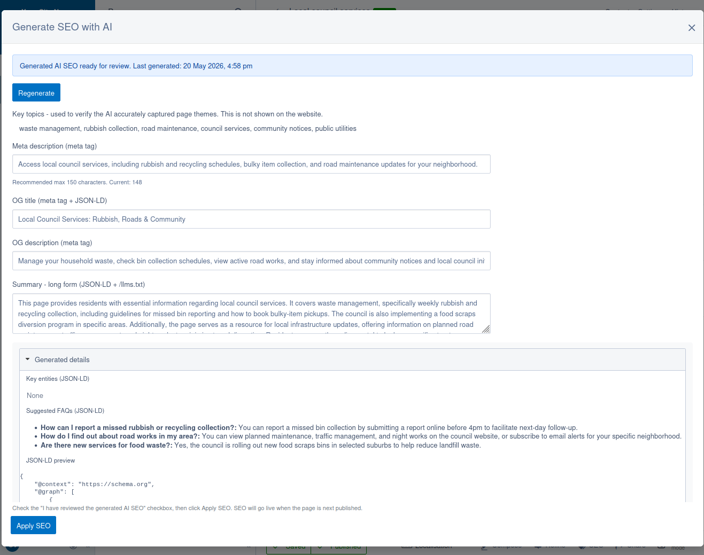

# AI SEO module for Silverstripe CMS

A Silverstripe CMS 6 module that automatically creates AI-assisted SEO content for page metadata and machine consumption.



## Installation

This module is hosted on a private GitHub repository and is not listed on Packagist. To install it, add the following to your project's `composer.json`:

```json
{
    "repositories": [
        {
            "type": "vcs",
            "url": "git@github.com:silverstripeltd/silverstripe-ai-seo.git"
        }
    ],
    // ...
    "require": {
        "silverstripeltd/ai-seo": "dev-main"
    }
}
```

## Development

When working on this module, AI tools (e.g. Claude Code, Copilot) should be run from the **project root**, not from within this directory. The module's `CLAUDE.md` should be symlinked to the project root so that AI tools pick it up automatically:

```bash
cd path/to/project

if [ -f CLAUDE.md ] || [ -L CLAUDE.md ]; then rm -f CLAUDE.md; fi
ln -s vendor/silverstripeltd/ai-seo/CLAUDE.md CLAUDE.md
```

`CLAUDE.md` contains the project identity, hard constraints, directory structure, and the module-specific testing, PHP coding, spec-editing, and command conventions in one place so the AI does not have to discover separate skill files at runtime.

Note that `CLAUDE.md` contains instructions for a specific Docker setup - you will probably need to update that file to match your local, standardised environment.

### Running tests and linting

From the project root:

- PHP unit tests:
  - `ssh webserver "cd /var/www && rm -rf /tmp/pu-cache && mkdir -p /tmp/pu-cache && SS_TEMP_PATH=/tmp/pu-cache nice -n 19 ionice -c 3 taskset -c 0 vendor/bin/phpunit vendor/silverstripeltd/ai-seo/tests/ --fail-on-warning"`
- PHP linting:
  - `ssh webserver "cd /var/www/vendor/silverstripeltd/ai-seo && nice -n 19 ionice -c 3 taskset -c 0 ../../bin/phpcs --ignore=*/thirdparty/*,*/node_modules/* --extensions=php ."`
- JS linting:
  - `ssh webserver "cd /var/www/vendor/silverstripeltd/ai-seo && NODE_OPTIONS=--max-old-space-size=512 nice -n 19 ionice -c 3 taskset -c 0 yarn lint"`
- JS build:
  - `ssh webserver "cd /var/www/vendor/silverstripeltd/ai-seo/client && NODE_OPTIONS=--max-old-space-size=512 nice -n 19 ionice -c 3 taskset -c 0 yarn install && NODE_OPTIONS=--max-old-space-size=512 nice -n 19 ionice -c 3 taskset -c 0 yarn build"`

## Configuration

All configuration is via environment variables (e.g. in your webserver env or `.env`). Restart your webserver after changing any values.

### Provider

Set the AI provider and API key. Gemini, OpenAI, and Anthropic are supported out of the box. Custom providers can be added by extending `AbstractAIProvider`.

```bash
AI_SEO_PROVIDER=gemini              # gemini (default), openai, or anthropic
AI_SEO_API_KEY=your-api-key         # API key for the chosen provider
```

### Model

Control which model is used and how it generates responses. All optional - sensible defaults are used if omitted.

```bash
AI_SEO_MODEL=gemini-3.1-flash-lite  # Model identifier (provider-specific)
AI_SEO_THINKING_LEVEL=low           # Thinking effort: none, low, medium, or high
AI_SEO_TEMPERATURE=1.0              # Sampling temperature (0.0–1.0)
AI_SEO_MAX_TOKENS=2000              # Max tokens in AI response
AI_SEO_REQUEST_TIMEOUT=15           # Timeout per AI request in seconds
```

### Queued jobs

The `GenerateAiSeoJob` processes pages in batches. These settings control rate limiting and scheduling.

```bash
AI_SEO_RATE_LIMIT_DELAY=6           # Min seconds between API request starts (see below)
AI_SEO_JOB_BATCH_SIZE=50            # Max pages processed per job run
AI_SEO_JOB_REQUEUE_DELAY=28800      # Seconds before scheduling next run (default: 8 hours)
```

The rate limit delay is measured from the **start** of each API request, not from when it finishes. If a request takes longer than the delay, the next request starts immediately with no extra wait.

### Meta description length

Control the recommended max character length shown in the CMS modal for `MetaDescription`.

```bash
AI_SEO_META_DESCRIPTION_MAX=150  # Recommended max characters (default: 150)
```

## Fluent compatibility

When `tractorcow/silverstripe-fluent` is installed, AI SEO is only available in the default locale. The toolbar button is hidden and controller access is blocked for all non-default locales. Non-Fluent installs are unaffected.

## Content tone

Generated metadata is always written in a professional, factual tone regardless of the voice or style used in the page content. This is intentional - metadata is consumed by search engines, social media platforms, and AI crawlers, which expect clear, neutral language for optimal indexing and display.

## Features

### /llms.txt

The module exposes a machine readable `/llms.txt` endpoint that lists pages with their summaries, intended for LLM and agent ingestion.

### CMS report

The `AiSeoReport` appears under CMS Reports and highlights pages missing metadata, stale metadata, or draft only metadata that has not been published yet. Its stale checks read page content from the Draft stage first, with Live used only when no Draft record exists.

### Background job

The `GenerateAiSeoJob` is available via the queued jobs UI and can be scheduled to generate or refresh metadata in bulk using the configured rate limits.

### Migration task

`MigrateExistingSeoTask` copies existing `SiteTree.MetaDescription` values into `GeneratedSeo` records for sites adopting the module.

### Draft and Live behaviour

`Draft` content is always used. All writes land on `Draft`:

- **Page editing** reads `Draft` content. Regenerating does not save anything until the editor submits, which writes to `Draft` and marks the metadata as reviewed.
- **Queued job and CMS report** also read `Draft` content. The queued job writes generated metadata to `Draft` and marks it as unreviewed. The report does not call the AI provider - it reads the stored metadata state and checks staleness against `Draft` content.
- **Publishing** the `GeneratedSeo` record happens through the normal page publish workflow. Reviewed metadata is published to `Live` together with the page. Unreviewed metadata stays on `Draft` until an editor reviews it.

## Tasks and queued jobs

Build tasks (run via `/dev/tasks`) are available for manual maintenance:

- `CreateAiSeoTestDataTask` - create or refresh AI SEO test pages and blocks.
- `MigrateExistingSeoTask` - copy existing `MetaDescription` values into `GeneratedSeo` records.

The queued job `GenerateAiSeoJob` processes SiteTree records in batches and respects the rate limiting configuration above.

## Frontend output

All frontend output is automatic — no template changes are required.

- **Meta tags** — `<meta name="description">`, `og:title`, and `og:description` are injected into the `<head>` via the standard `MetaTags()` call that Silverstripe templates already use.
- **JSON-LD structured data** — a `<script type="application/ld+json">` tag is automatically added to the `<head>` of every page that has generated metadata. It contains schema.org `Organization`, `WebPage`, `Article`, `FAQPage`, and `BreadcrumbList` entries, which search engines use to power rich results (FAQ dropdowns, breadcrumbs, article cards, etc.).
- **`/llms.txt`** — a machine-readable index of all pages with their summaries, served at the `/llms.txt` route for consumption by LLMs and AI agents.

## Where metadata fields are used

AI-generated values are stored on `SilverstripeLtd\AiSeo\Models\GeneratedSeo` and attached to pages via `SilverstripeLtd\AiSeo\Extensions\AiSeoExtension`.

Note: the HTML `<title>` tag is typically template-driven in Silverstripe; this module does not store or render a `MetaTitle` field.

### Fields rendered to the frontend

- **`MetaDescription`** — meta tags only. Returned via `getMetaDescription()` so core `SiteTree::MetaTags()` renders `<meta name="description">` without template changes.
- **`OGTitle`** — meta tags + JSON-LD. Injected as `og:title`; also used as JSON-LD `WebPage.name` / `Article.headline` (falls back to page title).
- **`OGDescription`** — meta tags only. Injected as `og:description`.
- **`SummaryLong`** — JSON-LD + `/llms.txt`. Used as JSON-LD `description`/`abstract` and as the per-page summary in `/llms.txt`.
- **`KeyEntities`** — JSON-LD only. Used as JSON-LD `about`/`mentions` (decoded from JSON and mapped to schema.org types).
- **`SuggestedFAQs`** — JSON-LD only. Used to emit `FAQPage` JSON-LD when present.

### CMS-only fields

- **`KeyTopics`** — shown in the modal to give content editors context about what the AI identified as the page's main topics. Helps editors judge whether the other generated fields are on track. Not rendered to the frontend.
